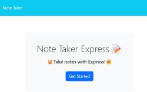
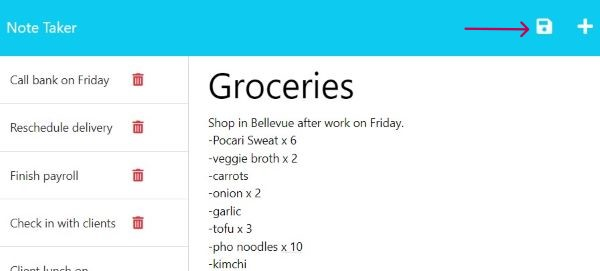

# Note Take Express

## Table of Contents

* [Description](#description)
* [Installation](#installation)
* [Usage](#usage)
* [Contributing](#contributing)
* [Questions](#questions)

  
## Description
  The Note Taker Express is a note-taking app that helps business owners stay organized and track tasks.

### User Story

AS A small business owner
I WANT to be able to write and save notes
SO THAT I can organize my thoughts and keep track of tasks I need to complete.
  
## Installation 
  
### Remote Repo 
1. Clone the [repo](https://github.com/ChristyGHanson/11-note-taker-express).
2. Open the repo in VS Code. 
3. This app uses Node.js and Express.js. Install these as necessary.
4. Open the command line and run `node server.js`.
5. The command prompt will read `Express server listening. PORT running on http://localhost:3000`.

## Usage

### Heroku

* Visit the Heroku deployment [here](link). 

* Once the program is running, you will see this homepage in the browser. Click the blue button to start writing notes.

* Click the plus sign in the navigation bar for `New Note`.

* After completing a note, a `Save` icon will pop up in the navigation bar. 
* Click the `Save` icon to save your note.
* View any saved notes by clicking on any note in the left-hand column.

## Contributing

* To contribute to this Github project, submit pull requests to [11-note-taker-express](https://github.com/ChristyGHanson/11-note-taker-express/pulls).
  
## Questions
  
For any further questions, message me on GitHub: [ChristyGHanson](https://github.com/ChristyGHanson)

Alternatively, you can send me an email: [chrsthnsn@gmail.com](mailto:chrsthnsn@gmail.com)
